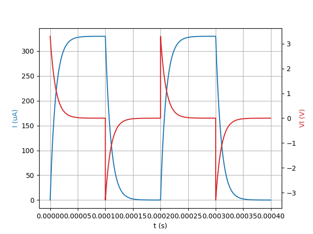
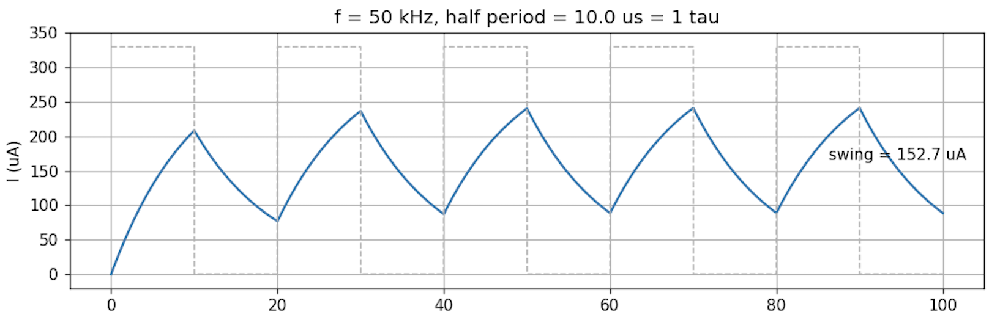

# RL Circuit Simulation with Numerical Methods

## 1. Purpose

In this experiment our purpose was to simulate the RL circuit and to integrate in
Python the equation we found with the loop rule.

## 2. Theory

### Forward Euler integration

We use this method to take the integral of a known `y = f(x)` function by assuming that
the rate of change stays constant along the `dt` interval:

```
f(x) = f(x-dx) + f'(x-dx)*dx
```

Since `dy = f'(x)*dx`, and since we accept `dy` as constant along one `dx` interval, it
gives us the value of the function `f(x)` at that point within a margin of error.
Normally, the smaller we take the change `dy` along that interval, the smaller the error
gets as well. Stability requires `dt < 2*tau`.

### Runge-Kutta method (RK4)

In this method we take 3 different measurements in a `dx` interval, at the beginning, the
middle and the end, and we take their weighted average:

```
k1 = f'(x)
k2 = f'(x) + (1/2)*k1*dx
k3 = f'(x) + (1/2)*k2*dx
k4 = f'(x) + dx*k3
f(x) = f(x) + (k1 + 2*k2 + 2*k3 + k4)*(dx/6)
```

`k1` gives the slope at the beginning of the interval, but since the curve bends along
this interval, that slope is not valid until the end. That is why we also measure the
slope at the middle point with `k2` and `k3`, and since we use `k1` while finding `k2`,
we correct the error carried by `k2` by measuring the middle point again with `k3`, and
with `k4` we take the slope at the end. The reason we choose the weights as 1, 2, 2, 1 is
that the middle point represents the average behaviour better. This way the total weight
becomes 6, and when we divide by 6 the average is obtained. While in Euler the error is
proportional to `dt`, here it is proportional to `dt^4`, so for the same `dt` it gives a
much more accurate result. Again, we also need to know a certain value of `f(x)`.

### Trapezoid method

Like the RK4 method we take the average of the slope at the beginning and at the end:

```
f(x) = f(x-dx) + (dx/2)*( f'(x-dx) + f'(x) )
```

Since in our equation `f'(x) = (1/tau)*(y-x)`, and since we know `f(x-dx)` but do not know
`f(x)`, we obtain an implicit equation, and we can solve it and find `f(x)`. Like
Runge-Kutta, this one also solves the integral by taking the average of the slope, but the
trapezoid method is solved implicitly. In RK4 we used to find `f(x)` by predicting it with
`k3`, while here we solve it directly and mathematically, and it is also 4 times cheaper
in terms of cost per step.

## 3. Difference between RL and RC

Even though the equation structure of the RL and RC circuits is the same, the most obvious
difference is that the direction of the time constant is reversed: `tau_rc = R*C`, while
`tau_rl = L/R`. In the RC circuit, increasing R slows the circuit down; in the RL circuit
it speeds it up.

As a measurement difference, in the RC circuit it can be done by measuring the voltage
directly from the output of the capacitor on the oscilloscope, while in the RL circuit it
is found indirectly through `i = Vr/R`.

And while in the RC circuit the voltage cannot jump suddenly, in the RL circuit it is
exactly the opposite: the current cannot jump suddenly. When the PWM square wave is cut
off, the current decreases exponentially because of the emf created by the coil, as is
also seen in the picture below, but the voltage jumps suddenly. In the RC circuit it is
exactly the opposite.



## 4. What we learned

I learned to write numerical methods in Python, and about the RL circuit: how the inductor
behaves under PWM, and how to solve integrals.

## 5. Conclusion

In this experiment we solved in Python, with 3 different numerical methods, the equation
`di/dt = (1/tau)*(V_in - i)` that we found from the loop rule of the RL circuit. Since we
chose `R = 10 kΩ` and `L = 0.1 H`, our time constant came out as `tau = L/R = 10 µs`, and
we drove the circuit with a 5 kHz, 3.3 V PWM.

Since the half period of the PWM is 100 µs, that is 10 times tau, the current settles
exactly on its final value at every switching. That is why in the graph we see completed
exponential curves instead of a sawtooth-like ripple.

To see the other extreme, we also ran the same circuit at 50 kHz, where the half period is
10 µs, that is exactly 1 tau. Now the current can no longer reach its final value of
`330 µA = 3.3 V / 10 kΩ` before the PWM switches, so instead of full exponentials we get a
triangular ripple that swings between about 89 µA and 242 µA. The peak-to-peak swing is
**152.7 µA**, which is 46 % of the 330 µA final value. This matches the analytical steady
state ripple `I_final * (1 - e^-1) / (1 + e^-1) = 152.5 µA`, so the simulation and the
theory agree.



For `n = 20000`, `dt` becomes 50 ns, that is `dt/tau = 0.005`. When we take a very fine
stepped RK4 solution as the reference and compare, the maximum errors came out as 16.6 mV
in Euler, 8.4 mV in trapezoid and 2.9 mV in RK4. But here something we did not expect
happened: even though the RK4 error is proportional to `dt^4`, it came out only 5 times
better than Euler. The reason for this is that the PWM is not a continuous signal. Since
the switching edge falls between two grid points, the error depends not on the order of
the method but a bit more on where the PWM ends, and because of this the method behaves
like first order.
